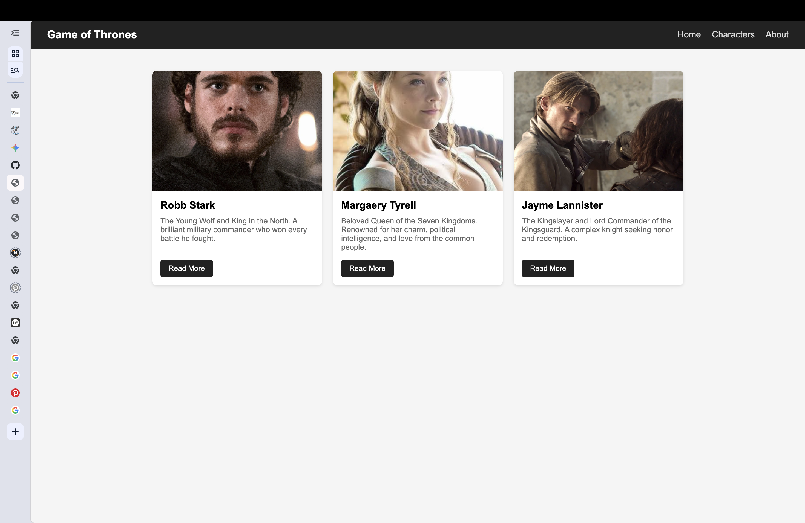
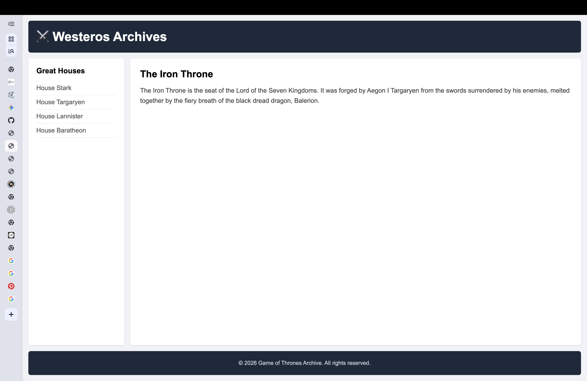
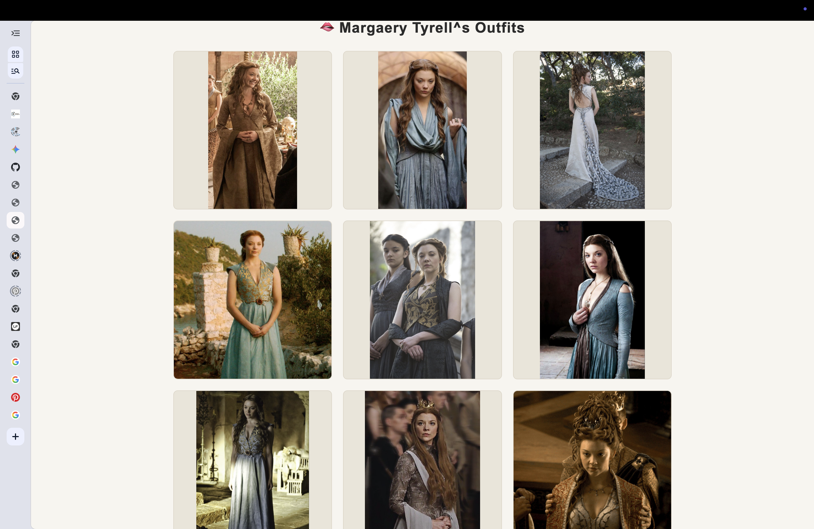
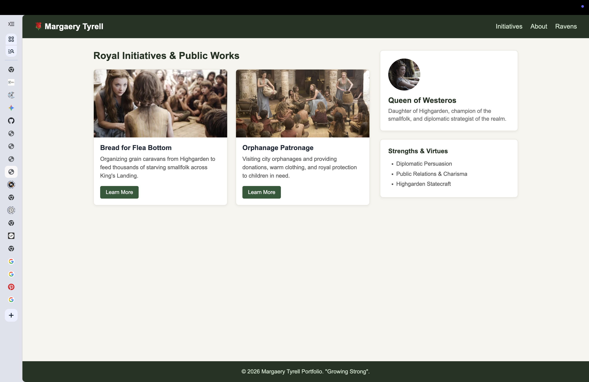

# Assignment 2 - Advanced CSS (Flexbox & Grid)

**Student:** Kaussar Meirambekkyzy  
**Group:** IT-2513

---
## Part 1. Flexbox

### Task 0 & Task 1: Navbar and Character Cards
In this part, I used Flexbox to build the header and the cards section.
- For the navbar, I used `display: flex`, `justify-content: space-between` to separate the logo and menu, and `align-items: center` to center them vertically.
- For the cards, I placed 3 of my favorite Game of Thrones characters in a row using `display: flex` and `gap: 20px`. All cards have equal height thanks to `flex: 1` and `align-items: stretch`. I also added a smooth hover lift effect with `transform: translateY(-5px)`.

## Part 2. Grid System

### Task 2: Page Layout with Grid Areas
Here I built a full-page layout using CSS Grid areas.
- I defined rows and columns on the container and mapped them using `grid-template-areas`.
- The header is at the top, the sidebar is on the left, the main content is on the right, and the footer stays at the bottom.

### Task 3: Image Gallery
I created a 3x3 photo gallery that shows Margaery Tyrell's outfits.
- Set `display: grid` with `grid-template-columns: repeat(3, 1fr)` and equal gaps.
- Used `aspect-ratio: 1 / 1` and `object-fit: contain` so the photos fit cleanly without getting cropped.
- Added a hover overlay using `position: absolute` and `opacity` transition so the outfit title shows up when you hover over an image.

## Part 3. Combining Flexbox & Grid

### Task 4: Portfolio Page
For the final task, I combined both layout methods to build a royal portfolio for Margaery Tyrell.
- The header uses Flexbox for navigation links.
- The main section uses CSS Grid (`grid-template-columns: 2fr 1fr`) to divide the page into initiatives on the left and the bio/skills sidebar on the right.
- Inside each initiative card, I used column Flexbox so the description pushes the button down to the bottom evenly.
- The footer stretches across the whole width at the bottom.

## Work Process Summary
1. Reset default browser margins and set `box-sizing: border-box`.
2. Practiced Flexbox for one-directional layouts (the navigation bar and the row of cards).
3. Learned CSS Grid for two-directional structures (grid areas template and the 3x3 gallery).
4. Combined both techniques in Task 4 to build a complete responsive page.